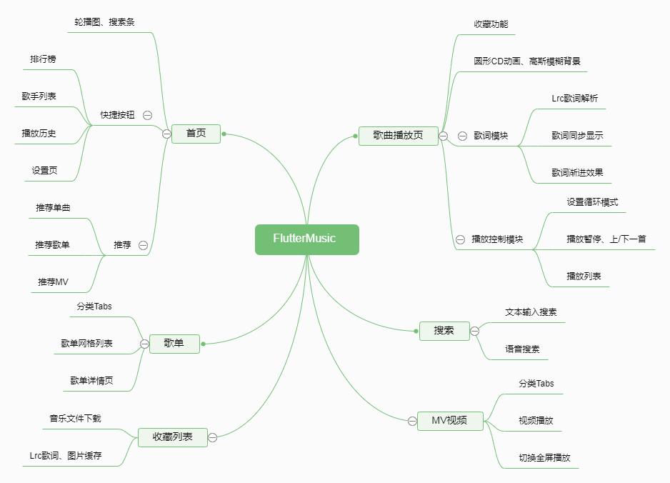
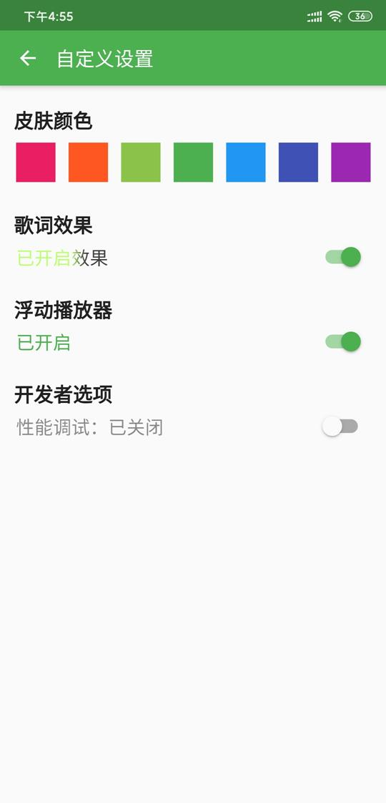

# flutter_music_player

## 简介
一款使用Flutter实现的音乐播放器，全面学习并运用Flutter各知识点。

- 试用apk下载地址：[flutter_music_release_1.0.apk](https://xwh817.github.io/apks/flutter_music_release.apk)
- 扫描二维码下载：
- 关于播放源：采用了开源项目[NeteaseCloudMusicApi](https://github.com/Binaryify/NeteaseCloudMusicApi)，如想稳定运行请自行下载并搭建自己的服务。
- 说明：本App仅限于学习，不得用于商业用途。

## 其他实现方式
> [React Native版](https://github.com/xwh817/RNMusicPlayer)

> [Java版](https://github.com/xwh817/MyMusicPlayer)

## 参考资料
- [Flutter中文网：Flutter实战](https://book.flutterchina.club/)
- [Flutter官网](https://flutter.dev/)
- [Dart编程语言入门](https://www.imooc.com/learn/1035)
- [技术胖](https://jspang.com)
- [Dart插件库](https://pub.flutter-io.cn/)
- [Flutter从入门到进阶 实战携程网App](https://coding.imooc.com/class/321.html)
- [Flutter 移动应用](https://ninghao.net/package/flutter)

## 功能结构图

## App界面

### 播放页面
- 播放、暂停、上一首、下一首。
- 歌词同步渐进显示、自动滚动效果。

### 首页、歌单、MV视频
- 首页：顶部轮播图、搜索框、推荐（单曲、歌单、MV）。
- 歌单：按类别显示的歌单网格列表。
- MV视频：可直接点击播放，也可进入全屏播放。

| 首页 |  歌单    | MV视频 |
| :------: | :----: | :----: |
| |      |  |

### 视频全屏播放
- 播放、暂停、可拖动进度条
- 可切换全屏/非全屏

### 歌单详情、歌手列表
| 歌单详情 |  歌手列表 |
| :------: | :----: |
| |      |

### 不同的主题色
- 使用Provider来管理全局状态，做到实时更新所有界面。
- 集齐“红橙黄绿青蓝紫”七色，总有一色属于你：

| 绿色 |  红色    | 紫色 |
| :------: | :----: | :----: |
| |      |  |

### 其他页面
- 设置页：可设置主题色、浮动播放器、歌词效果。
- 搜索页：支持文本输入搜索、语音识别搜索

| 设置页 |  搜索页 |
| :------: | :----: |
| |      |

## 知识点总结
- Dart语言基础学习:[Dart编程语言入门](https://www.imooc.com/learn/1035)
- 界面基本结构
  - StatelessWidget
  - StatefulWidget
  - PageView + TabBar 多页展示
  - App整体样式设置
  - 启动等待界面设置
  - Row、Column、Stack 等布局组件
  - Align、Center 等定位组件
  - AspectRatio、SizedBox、Expended 等有用的组件
  - ListView、GridView的各种构建方法
  - CustomScrollView，sliver子控件实现混杂布局。
  - SliverAppBar的滚动、浮动、可伸缩效果
  - Scaffold
    - AppBar
    - body
    - bottomNavigationBar
    - floatingActionButton
  - 路由跳转和页面跳转效果设置
- 基础控件
  - Text style样式 多样式混排
  - Card 圆角阴影
  - Container 设置宽高、设置边框样式
  - ListTile
  - Clip裁切控件，圆角、圆形控件。
  - Image 本地图片、网络图片
  - 组件间数据传递
  - 组件状态维护
  - BoxDecoration 实现圆角、阴影、背景效果。
  - Toast、SnackBar等提示控件使用
  - Dialog使用
  - 各种Button：FlatButton、RaisedButton、OutlineButton
  - Future使用，熟练ascyn、await
  - AnimationController 动画控件，类似Android的值动画
- 自定义控件
  - 初接触Flutter会感觉控件嵌套层次会很深（地狱嵌套），其实多进行功能抽取就不会了。
  - 例如播放界面，页面结构复杂，但是将功能块抽出为单独控件，页面就很清晰了。
  - 具有点击动画的控件
  - 圆角搜索框
  - 使用CustomPainter绘制语音动画
- 状态管理
  - 子控件自己维护，StatefullWidget。
  - 由父控件维护，状态通过参数传入子组件。
  - 子控件回调，将回调Function传入子控件，例如底部菜单点击。
  - Provider全局状态维护，全局皮肤、播放状态等。
- 离线缓存
  - 音乐App接口变化实时性不高，因此封装了离线模块。
  - 将访问过的Json数据保存到本地，下次重复请求时，直接从本地获取。
  - 使App体验更好，减少网络卡顿，节约流量。
  - 无网情况下仍能打开之前访问过的界面。
- 开发利器，插件使用
  - 图片缓存CachedNetworkImage实现图片持久化到本地，Flutter默认缓存到内存，但不持久化。
  - 音乐播放：audioplayer
  - 视频播放：video_player (底层原理是各平台实现对应播放器，例如Android端使用EXOPlayer)
  - 轮播图：flutter_swiper
  - 文本编解码：crypto 例如md5等工具。
  - 网络连接检测：connectivity
  - 横竖屏切换：orientation
  - SQLite数据库：sqflite
  - HTTP网络请求：dio
  - Toast提示：fluttertoast
  - 配置信息持久化：shared_preferences
- 自定义插件
  - 有些功能可能在插件库中找不到，需要自定义插件
  - 例如语音识别，实现步骤：
    - dart端：定义插件接口，约定要访问的方法、参数。
    - java端：新建对应项目，导入so文件；实现接口对应功能；实现方法调用回调；
    - ios端：和java端类似。
- 打包发布
  - flutter build apk
  - 修改gradle配置，解决so包冲突问题
  - 开启调试，查看页面绘制效率。
  - 发现debug版的App会运行卡顿，打包成release版本时就没问题了。