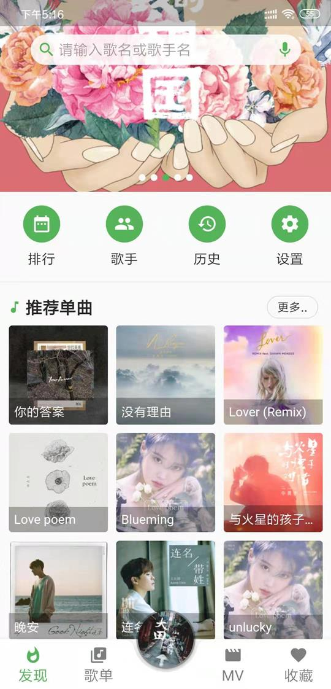
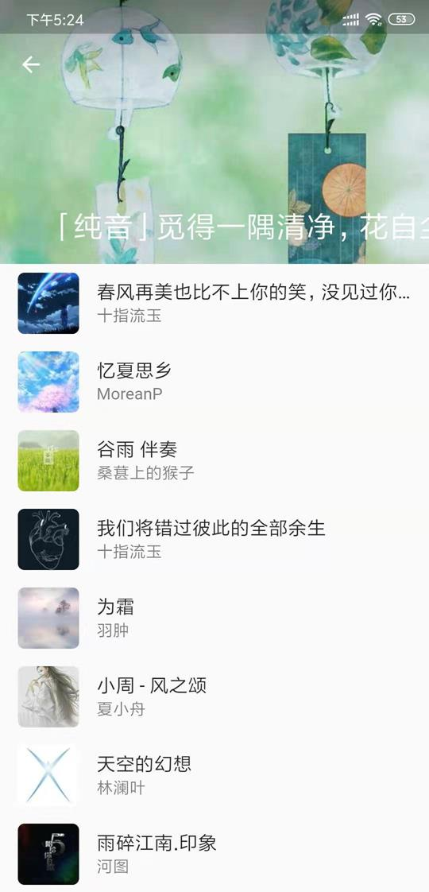
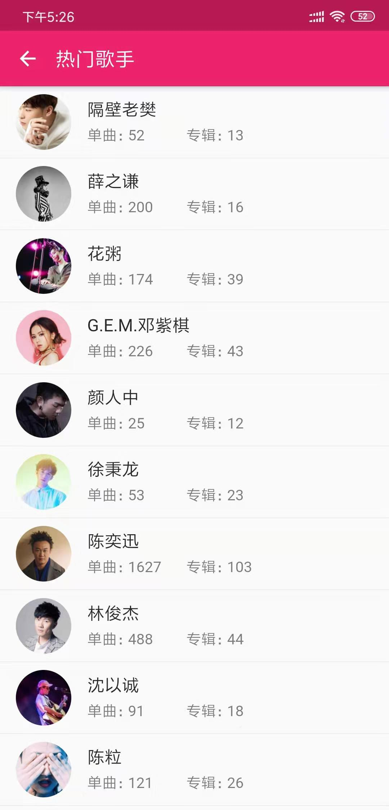
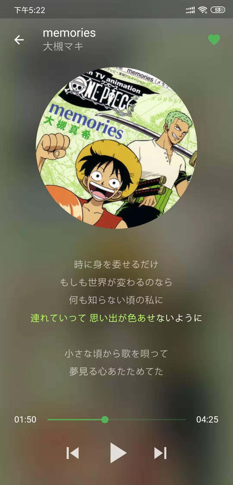
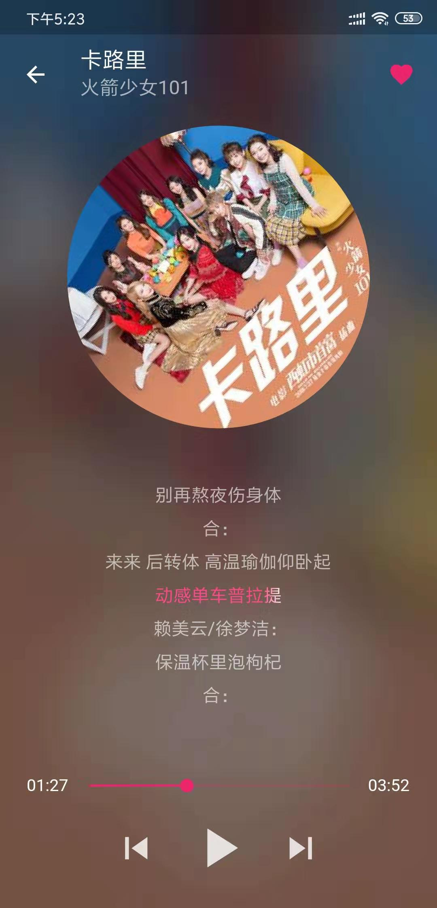
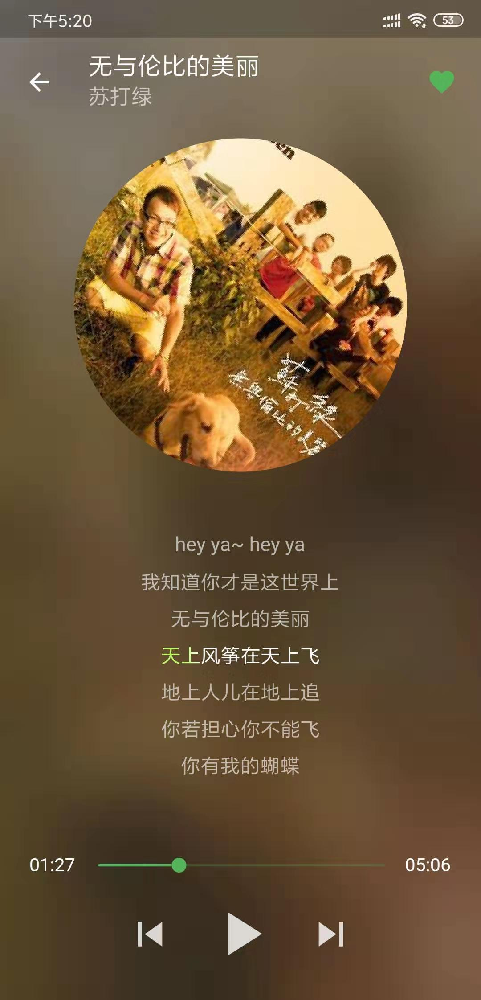
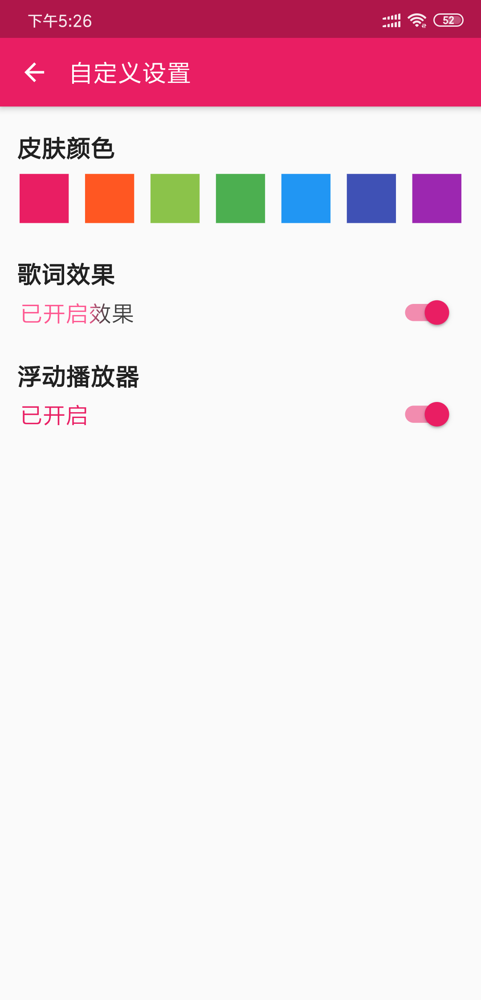
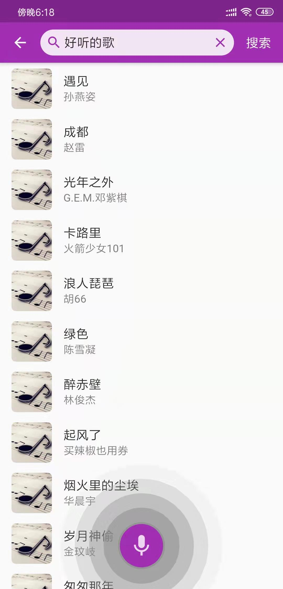

# flutter_music_player

一款使用Flutter实现的音乐播放器，全面学习并运用Flutter各知识点。

## 参考资料
- [Flutter中文网：Flutter实战](https://book.flutterchina.club/)
- [Flutter官网](https://flutter.dev/)
- [Dart编程语言入门](https://www.imooc.com/learn/1035)
- [技术胖](https://jspang.com)
- [Dart插件库](https://pub.flutter-io.cn/)
- [Flutter从入门到进阶 实战携程网App](https://coding.imooc.com/class/321.html)
- [Flutter 移动应用](https://ninghao.net/package/flutter)

## App界面
### 首页、歌单、MV视频

   &nbsp;&nbsp;
   &nbsp;&nbsp;
  

### 歌单详情、歌手列表

   &nbsp;&nbsp;
   &nbsp;&nbsp;

### 播放页面，不同的主题色

   &nbsp;&nbsp;
   &nbsp;&nbsp;
   &nbsp;&nbsp;

### 设置页

   &nbsp;&nbsp;
   &nbsp;&nbsp;

## 知识点总结
- Dart语言基础学习:[Dart编程语言入门](https://www.imooc.com/learn/1035)
- 界面基本结构
  - StatelessWidget
  - StatefulWidget
  - PageView + TabBar 多页展示
  - App整体样式设置
  - 启动等待界面设置
  - Row、Column、Stack 等布局组件
  - Align、Center 等定位组件
  - AspectRatio、SizedBox、Expended 等有用的组件
  - ListView、GridView的各种构建方法
  - CustomScrollView，sliver子控件实现混杂布局。
  - SliverAppBar的滚动、浮动、可伸缩效果
  - Scaffold
    - AppBar
    - body
    - bottomNavigationBar
    - floatingActionButton
  - 路由跳转和页面跳转效果设置
- 基础控件
  - Text style样式
  - Card 圆角阴影
  - Container 设置宽高、设置边框样式
  - ListTile
  - Clip裁切控件，圆角、圆形控件。
  - Image 本地图片、网络图片
  - 组件间数据传递
  - 组件状态维护
  - BoxDecoration 实现圆角、阴影、背景效果。
  - Toast、SnackBar等提示控件使用
  - Dialog使用
  - 各种Button：FlatButton、RaisedButton、OutlineButton
  - Future使用，熟练ascyn、await
  - AnimationController 动画控件，类似Android的值动画
- 自定义控件
  - 具有点击动画的控件
  - 圆角搜索框
  - 自定义http接口缓存，无网情况下仍能打开界面
  - 使用CustomPainter绘制语音动画
- 状态管理
  - 子控件自己维护，StatefullWidget。
  - 由父控件维护，状态通过参数传入子组件。
  - 子控件回调，将回调Function传入子控件，例如底部菜单点击。
  - Provider全局状态维护，全局皮肤、播放状态等。
- 开发利器，插件使用
  - 图片缓存CachedNetworkImage实现图片持久化到本地，Flutter默认缓存到内存，但不持久化。
  - 音乐播放：audioplayer
  - 视频播放：video_player (底层原理是各平台实现对应播放器，例如Android端使用EXOPlayer)
  - 轮播图：flutter_swiper
  - 文本编解码：crypto 例如md5等工具。
  - 网络连接检测：connectivity
  - 横竖屏切换：orientation
  - SQLite数据库：sqflite
  - HTTP网络请求：dio
  - Toast提示：fluttertoast
  - 配置信息持久化：shared_preferences
